# Sketchpad

This app allows users to make and save doodles. The paragraphs below explain how to use the app.   Happy Doodling!
   

## Table of Contents  
 - [Add Sketch](#add-sketch)  
 - [Save Sketch](#save-sketch)
 - [Edit Sketch](#edit-sketch)  
 - [Renaming and Searching](#searching-and-renaming)
 - [Delete a Sketch](#delete-a-sketch)

 
<a name="add-sketch"/>

## Add Sketch
On pressing the *Add Button* at the bottom left of the screen, you enter the *Sketchpad* where you can doodle away.

   
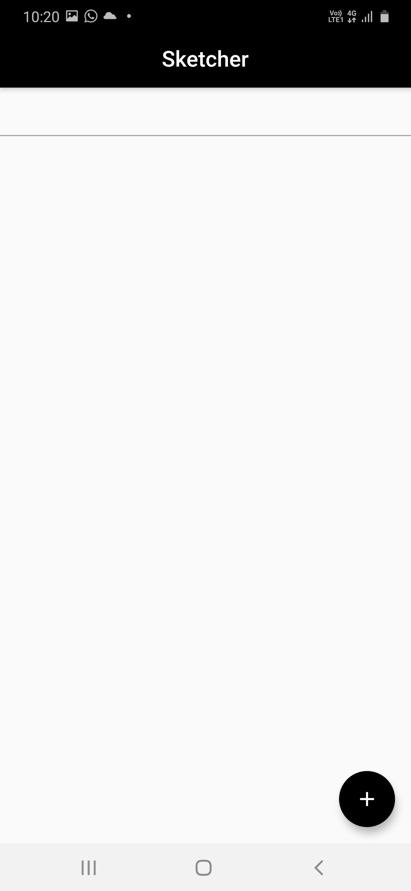 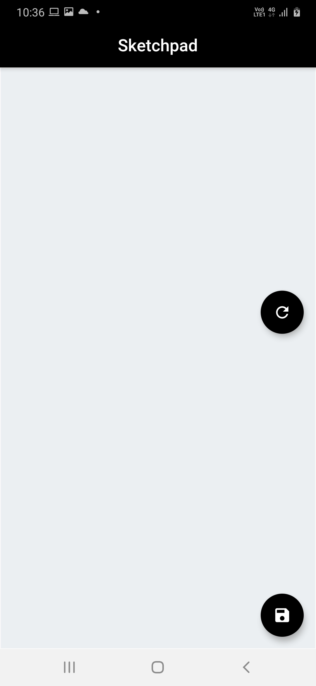
    
<a name="save-sketch"/>

## Save Sketch

A sketch can be saved by clicking on the *Save Button* at the bottom right corner of the screen. Once clicked, a popup dialog box appears where the user names the sketch. Giving an empty text or an already used file name is not allowed.
   
 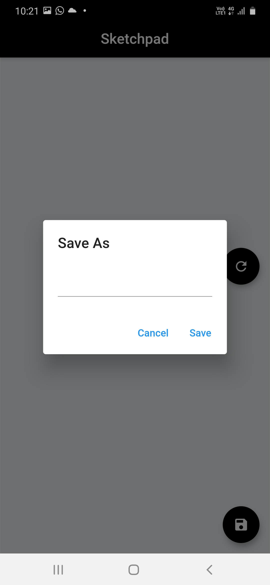 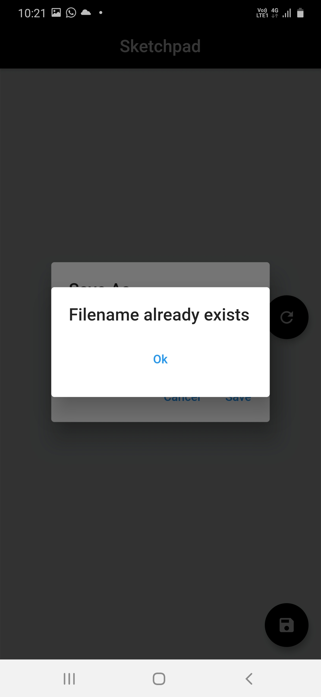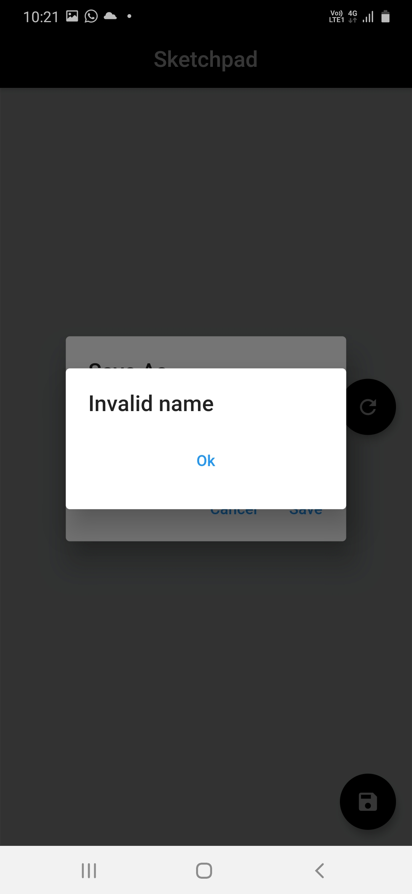
   
 
<a name="edit-sketch"/>

## Edit Sketch
On clicking on a saved sketch in *Sketcher* , you can open it and edit it. If you want to clear the sketch, you can do it by clicking in on the *Clear Button* on the right of the screen.
   
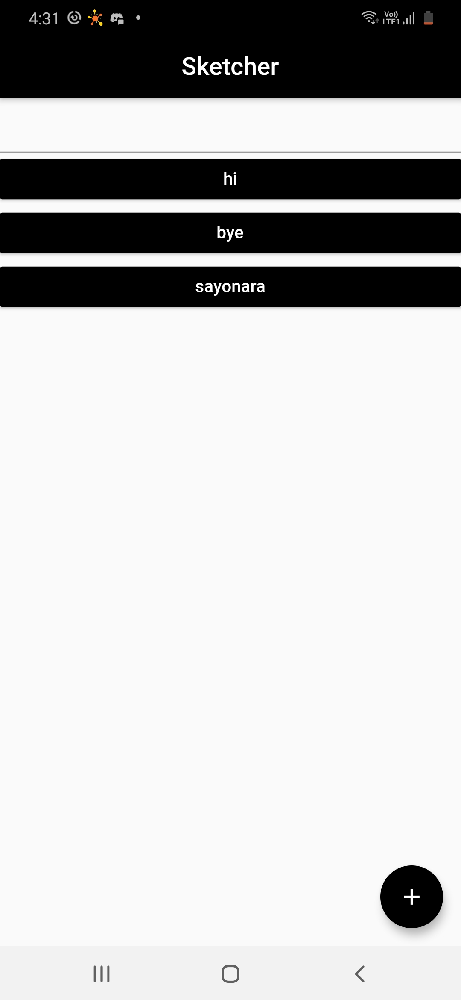 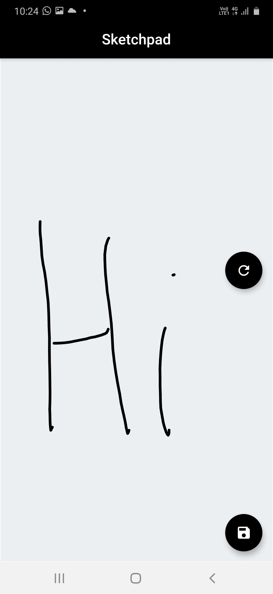 
    
<a name="searching-and-renaming"/>

## Renameing and Searching

To rename a sketch, press on it and a dialog box appears to rename the sketch.
 To search for a given sketch, type the name in the *Searchbar*  and the list will only show the relevant Sketches.
   
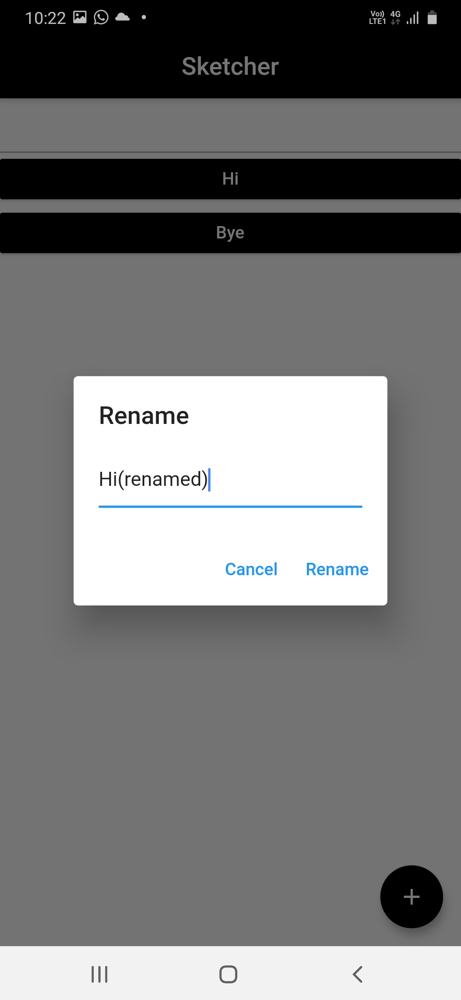  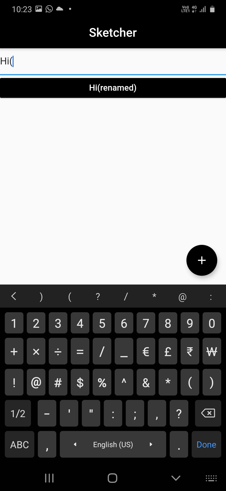
    
<a name="delete-a-sketch"/>
## Delete a Sketch

To delete a sketch, just slide the sketch left or right in *Sketcher* view .
   
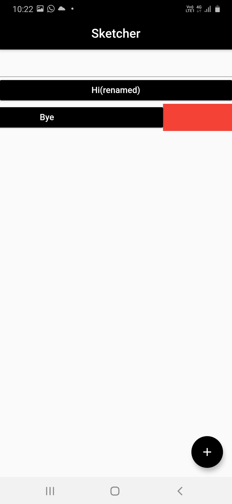 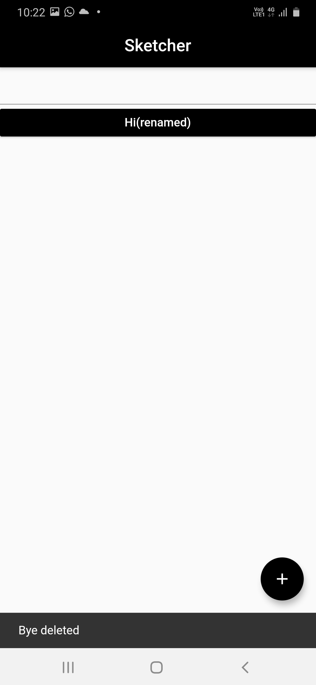
   

